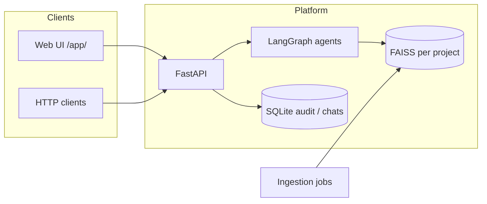
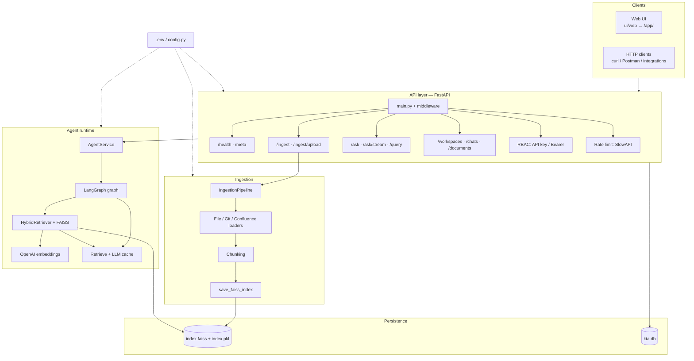
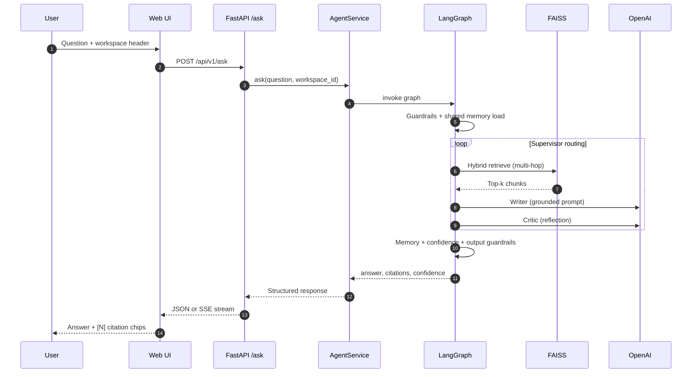
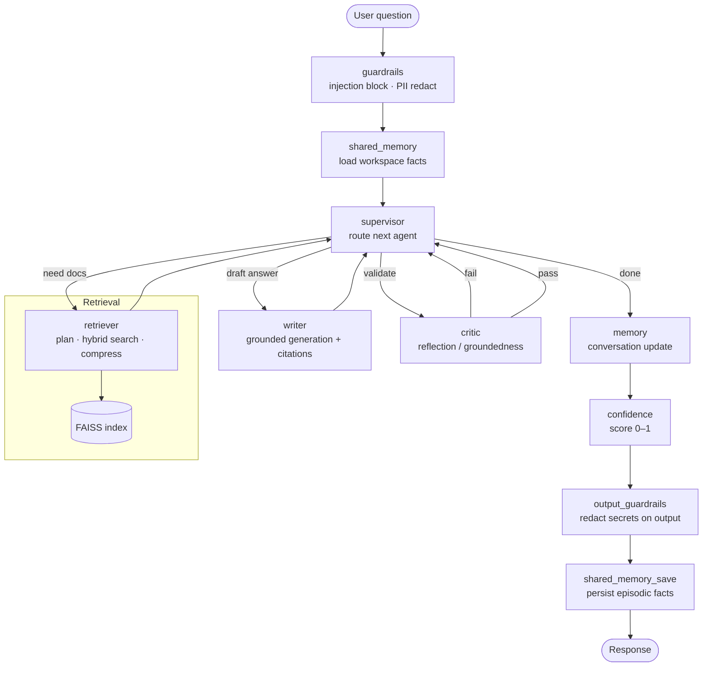
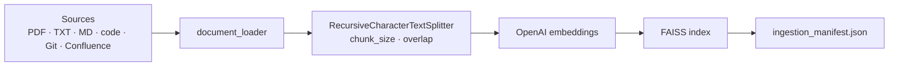
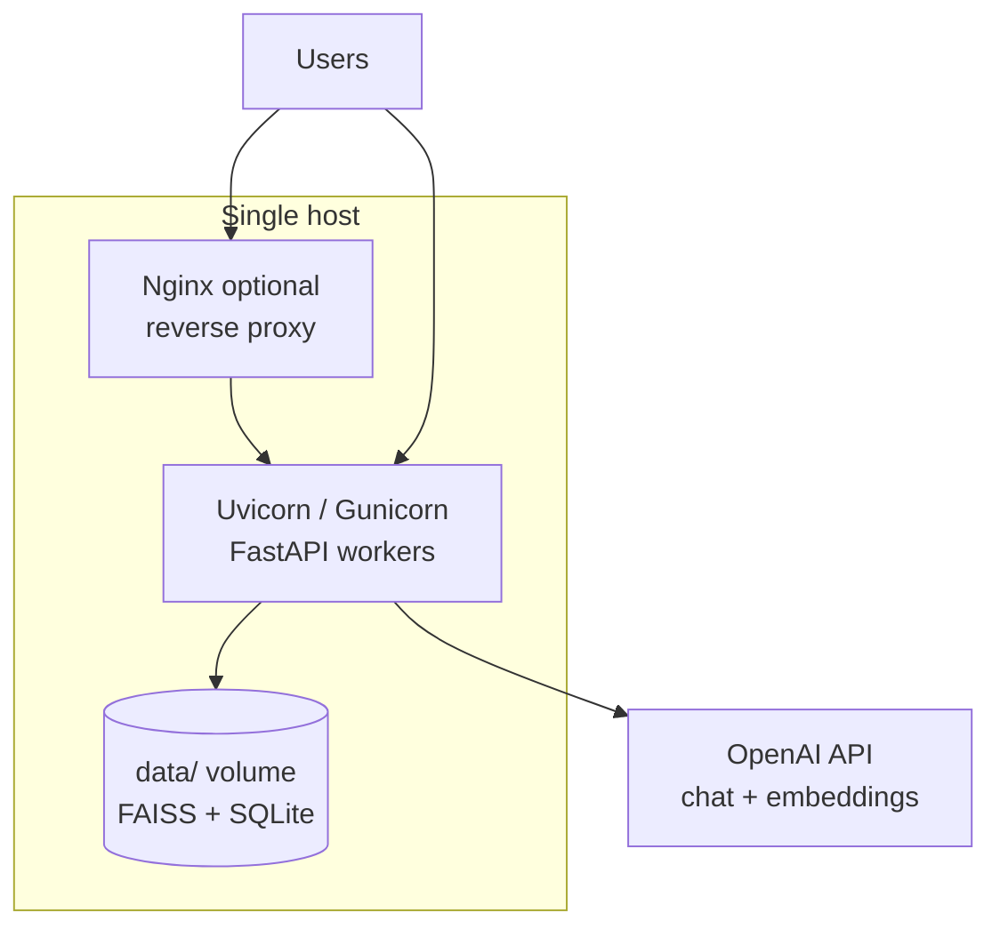

# Architecture — Enterprise Knowledge Transfer Agent

This document describes how the system is structured end-to-end: clients, API, agent graph, ingestion, storage, and deployment.

For interview talking points and Q&A, see [interview_guide.md](interview_guide.md).

---

## 1. System overview

The product is a **workspace-scoped RAG assistant**:

1. **Ingest** internal documents and code into a per-project **FAISS** index.
2. **Retrieve** relevant chunks at query time (hybrid semantic + keyword).
3. **Generate** grounded answers with `[N]` citations via a **LangGraph multi-agent** workflow.
4. **Validate** answers with a critic/reflection step and attach a **confidence** score.



---

## 2. Layered architecture

| Layer | Responsibility | Key modules |
|-------|----------------|-------------|
| **Presentation** | Chat UI, upload, citations, projects | `ui/web/` served at `/app/` |
| **API** | REST, streaming, auth, rate limits | `api/main.py`, `api/routes*.py` |
| **Agent** | Multi-hop RAG orchestration | `agent/graph.py`, `agent/multi_agent/` |
| **Retrieval** | Embeddings, FAISS, hybrid search | `retrieval/vector_store.py`, `hybrid_retriever.py` |
| **Ingestion** | Load, chunk, embed, persist | `ingestion/pipeline.py` |
| **Core** | Workspaces, guardrails, cache, metrics | `core/workspaces.py`, `core/database.py` |



> Source file for editing: [diagrams/project_system_architecture.mmd](diagrams/project_system_architecture.mmd)

---

## 3. Request flow (ask)



**Workspace scoping:** every request carries `X-Workspace-Id`. Retrieval loads only that project's FAISS index (`core/workspaces.py` → `workspace_index_path`).

---

## 4. LangGraph multi-agent workflow

The compiled graph (`agent/graph.py`) runs this pipeline:

```
guardrails → shared_memory → supervisor ⇄ (retriever | writer | critic) → memory → confidence → output_guardrails → shared_memory_save → END
```



| Agent | Role |
|-------|------|
| **guardrails** | Block prompt injection; redact PII/secrets on input |
| **shared_memory** | Load long-term workspace memory before retrieval |
| **supervisor** | Routes to retriever, writer, critic, or finish |
| **retriever** | Sub-query planning, hybrid FAISS retrieval, optional compression |
| **writer** | Strict grounded prompt; requires citation markers `[N]` |
| **critic** | Validates groundedness; failed critique loops back via supervisor |
| **memory** | Updates per-thread conversation state |
| **confidence** | Maps critic outcome to a 0–1 trust score |
| **output_guardrails** | Final safety pass on the answer text |
| **shared_memory_save** | Writes durable facts back to workspace memory |

Each node is wrapped with **Prometheus timing** (`kta_agent_duration_seconds`).

---

## 5. Ingestion pipeline

Documents enter the system through the **web UI upload**, **API ingest endpoints**, or **CLI** (`scripts/ingest.py`).



**Incremental indexing** (`ingestion/pipeline.py`):

| Manifest change | Behaviour |
|-----------------|-----------|
| No change | Skip re-embed (fast path) |
| Add only | `add_documents` to existing FAISS |
| Modified / removed | Full rebuild (`replace_index`) |

**Async uploads:** `POST /api/v1/ingest/upload` saves files under `data/web_uploads/{workspace}/` and queues a background job (`services/ingest_jobs.py`). Poll `GET /api/v1/ingest/jobs/{id}` for progress.

---

## 6. Data & storage layout

```
data/
├── faiss_index/                    # Default project (legacy path if index exists)
│   ├── index.faiss                 # Embedding vectors
│   ├── index.pkl                   # Chunk text + metadata
│   └── ingestion_manifest.json
├── workspaces/
│   └── {project-id}/
│       └── faiss_index/            # Isolated index per project
├── web_uploads/{project}/          # Raw uploaded files (server-side)
├── git_clones/                     # Cloned repos (Git ingest)
└── kta.db                          # SQLite: chats, audit, ingest jobs, memory
```

| Store | What it holds |
|-------|----------------|
| **FAISS** | Embeddings + chunk metadata (`source`, `doc_id`, `workspace_id`) |
| **SQLite** | Chat threads, messages, audit log, ingest job status, shared memory |
| **web_uploads/** | Original files before indexing (not queried at runtime) |

**Citation rule:** `[N]` in an answer refers to the **N-th retrieved context chunk** for that response, not a file number or PDF page by default.

---

## 7. Workspace isolation

Each **project** (workspace) has:

- Its own FAISS directory under `data/workspaces/{id}/faiss_index/`
- Its own upload folder under `data/web_uploads/{id}/`
- Scoped chat threads and shared memory in SQLite

The API resolves the active project from `X-Workspace-Id` (default: `default`). Retrieval **never** mixes chunks across projects.

---

## 8. API surface (summary)

| Group | Endpoints |
|-------|-----------|
| **Q&A** | `POST /api/v1/ask`, `POST /api/v1/ask/stream`, `POST /api/v1/query` |
| **Ingest** | `POST /api/v1/ingest`, `POST /api/v1/ingest/upload`, `GET /api/v1/ingest/jobs/{id}` |
| **Projects** | `GET/POST /api/v1/workspaces`, `DELETE /api/v1/workspaces/{id}` |
| **Chats** | `GET/POST /api/v1/chats`, messages CRUD |
| **Library** | `GET /api/v1/documents`, audit log, shared memory |
| **Ops** | `GET /api/v1/health`, `GET /metrics` |

---

## 9. Cross-cutting concerns

| Concern | Implementation |
|---------|----------------|
| **Auth** | Optional RBAC via `ENABLE_RBAC` + `SECRET_KEY` (API key / Bearer) |
| **Rate limiting** | SlowAPI on API routes |
| **Caching** | Retrieval and LLM invoke cache (`core/cache.py`) |
| **Retries** | Exponential backoff on LLM calls |
| **Observability** | Structured logging middleware, Prometheus `/metrics`, query audit |
| **Safety** | Input/output guardrails, abstain when evidence is insufficient |

---

## 10. Deployment view



- **Docker:** `Dockerfile` + `docker-compose.yml` — mount `./data` for index persistence.
- **Scale-out:** run multiple API replicas behind a load balancer; share the `data/` volume or move FAISS to a shared/object store pattern; SQLite is single-writer — use Postgres for multi-replica chat/audit at scale.

Example scaled layout: `docker-compose.scale.yml`, `deploy/nginx/nginx.conf`, `scripts/run_scaled_api.sh`.

---

## 11. Architecture diagrams (images)

Pre-rendered diagrams in the repo:

| File | Description |
|------|-------------|
| [diagrams/kta_rag_langgraph_architecture.png](diagrams/kta_rag_langgraph_architecture.png) | RAG + LangGraph overview |
| [diagrams/kta_project_architecture_vertical.png](diagrams/kta_project_architecture_vertical.png) | Vertical system layout |
| [Generated_image.png](Generated_image.png) | Agent flowchart |

Edit Mermaid sources in `docs/diagrams/*.mmd` and render at [mermaid.live](https://mermaid.live).

---

## 12. Key design decisions

| Decision | Rationale | Trade-off |
|----------|-----------|-----------|
| **FAISS on disk** | Fast local retrieval, simple ops | Horizontal scale needs sharding or managed vector DB |
| **Per-workspace indexes** | Strong isolation between projects | Duplicate embeddings if same doc in two projects |
| **LangGraph multi-agent** | Explicit routing, retries, testable agents | More moving parts than a single chain |
| **Hybrid retrieval** | Better recall on keyword-heavy docs | More chunks to rank and filter |
| **Strict grounding + critic** | Enterprise trust; fewer hallucinations | May abstain more often |
| **Vanilla web UI** | No frontend build step; served by FastAPI | Less component ecosystem than React SPA |
