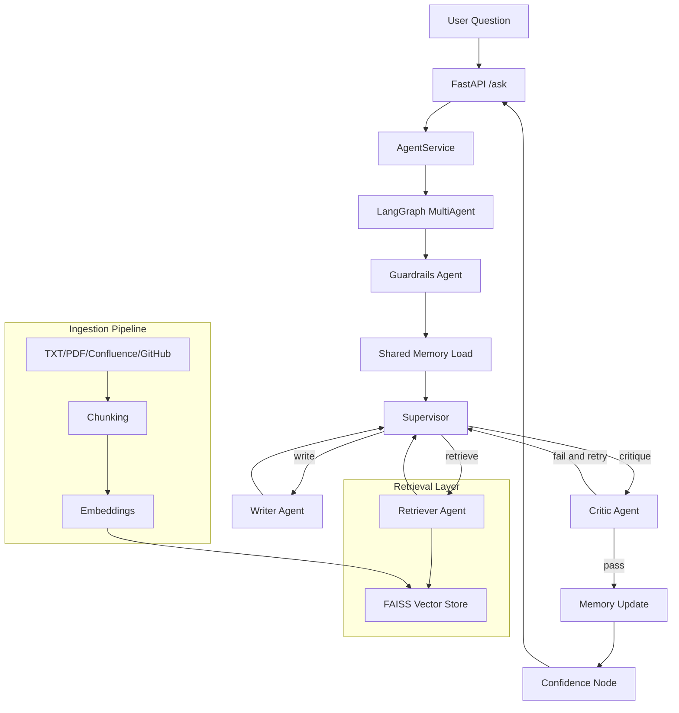
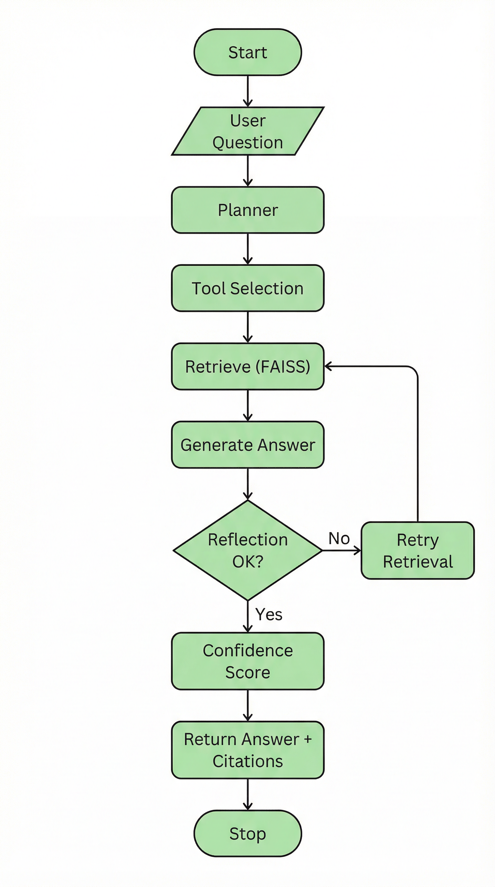
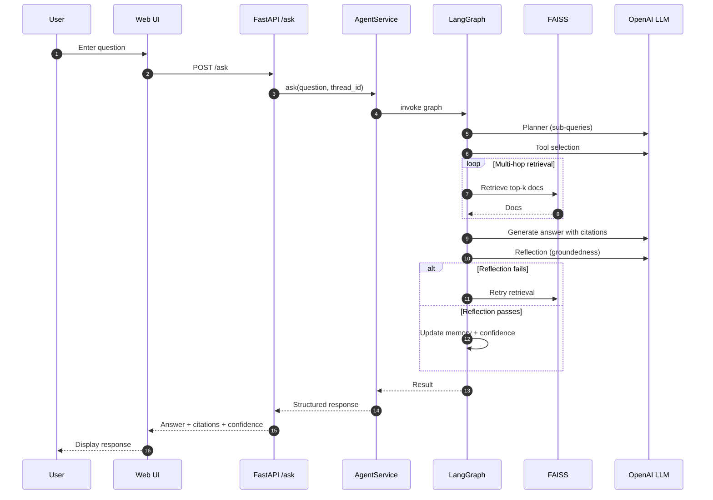

# Enterprise Knowledge Transfer Agent (Interview Guide)

## What it is
A production-ready RAG system for onboarding and knowledge transfer. It ingests internal docs (TXT/PDF, Confluence, GitHub), builds a FAISS vector index, and serves a FastAPI backend with a web UI at `/app/`. The agent uses LangGraph **multi-agent** orchestration: supervisor + retriever + writer + critic, then confidence.

## Key capabilities
- **Strictly grounded answers** with citations
- **Planner + multi-hop retrieval** for complex questions
- **Reflection + confidence** to reduce hallucinations
- **Guardrails**: prompt-injection block, PII/secret redaction on input and output
- **Shared memory**: workspace-scoped long-term memory across turns (agents read/write)
- **Monitoring**: Prometheus `/metrics`, per-agent timings, request/audit logs, `/health`
- **Caching + retries + rate limiting** for reliability
- **Query logging** for audit and improvement loop

## High-level flow (Mermaid)



## Flowchart Image



## Detailed flow (Mermaid)



## Component breakdown

### 1) Ingestion
- **Document loaders**: TXT/PDF + optional Confluence/GitHub
- **Chunking**: Recursive splitter with overlap
- **Embeddings**: OpenAI embeddings
- **Vector store**: FAISS saved to disk

### 2) Retrieval
- **Hybrid retriever**: Semantic + MMR keyword
- **Multi-hop**: Planner produces sub-queries; retrieval loops over hops

### 3) Multi-agent (LangGraph)
- **Guardrails**: Blocks prompt injection; redacts PII/secrets on input (and output)
- **Shared memory**: Loads workspace long-term facts before retrieval; saves episodic Q/A after success
- **Supervisor**: Routes work to specialists (retrieve / write / critique / finish)
- **Retriever agent**: Plans sub-queries, hybrid multi-hop FAISS retrieval, optional compress
- **Writer agent**: Strict grounded prompt, citations required (sees shared memory + docs)
- **Critic agent**: Validates groundedness and citation markers (reflection)
- **Confidence**: Scores response based on critic outcome (not a fifth agent)
- **Memory**: Conversation history per thread + shared_memory_save

### 4) API + UI
- **FastAPI**: `/ask`, `/query`, `/health`
- **Web UI**: ChatGPT-style interface at `/app/` (projects, conversations, upload, citations)
- **Middleware**: Logging + rate limiting

## Strong interviewer talking points
- Why LangGraph: explicit control-flow, conditional edges, and retries
- Reliability: retries, rate limiting, caching, structured error handling
- Safety: strict grounding, reflection, and “No sufficient data” fallback
- Extensibility: pluggable cache, logger, and vector store backends

## Example response format
```json
{
  "answer": "...",
  "citations": [{"source": "file", "doc_id": "..."}],
  "reflection_status": "Validation passed",
  "confidence_score": 0.9,
  "agent_trace": ["supervisor", "retriever", "supervisor", "writer", "supervisor", "critic", "supervisor"]
}
```

## Interview Narrative (Senior-Level Explanation)

### 1. Problem statement
Most enterprises lose time onboarding engineers because internal knowledge is scattered across Confluence, GitHub, runbooks, and incident notes. Traditional search returns documents, but not contextual answers or traceability. The goal was to build a knowledge transfer agent that provides accurate, citation‑backed answers and explicitly returns **“No sufficient data”** when sources don’t support a response.

### 2. Architecture overview
The system is a **RAG‑based agent** orchestrated with **LangGraph**:
- **Ingestion pipeline** builds a FAISS index from internal docs.
- **Hybrid retrieval** combines semantic similarity and MMR.
- **LangGraph agent** handles multi-agent flow: supervisor → retriever → writer → critic → confidence.

The core principle is strict grounding: every factual claim must be backed by retrieved context.

### 3. Ingestion pipeline
The ingestion layer is modular and production‑ready:
- **Loaders** for TXT/PDF + optional Confluence/GitHub.
- **Recursive chunking** with overlap for context preservation.
- **Embeddings** via OpenAI.
- **FAISS index** persisted to disk.

All metadata (source, file path, type) is preserved for traceable citations.

### 4. Agent orchestration using LangGraph
LangGraph provides explicit control flow for a **multi-agent** system (not just a linear chain):
```
Supervisor → Retriever → Writer → Critic → (retry Retriever) → Confidence
```
The supervisor routes between specialist agents. Conditional retry runs when the critic rejects an ungrounded answer. Agents are isolated and testable.

### 5. Multi‑hop retrieval logic
Complex questions require multiple hops. The planner decomposes the query into sub‑queries. Retrieval loops over those hops and aggregates evidence. This improves recall without flooding the context with irrelevant chunks.

### 6. Grounded generation strategy
Generation uses a strict system prompt:
- **Answer only from context**
- **Cite every claim**
- If insufficient evidence, respond with **“No sufficient data”**

This keeps output defensible and minimizes hallucinations.

### 7. Critic (reflection) & confidence mechanism
The **critic agent** validates groundedness and citation correctness using structured output. If critique fails, the supervisor can send work back to the retriever. Confidence scoring reflects groundedness and evidence quality, producing a 0–1 score for UI trust signals.

### 8. Production‑readiness aspects
- **Retries with exponential backoff** for LLM calls
- **Rate limiting** via SlowAPI
- **Caching** for retrieval and generation
- **Structured error handling** with typed exceptions
- **Query logging** for audit and feedback
- **Prometheus metrics** (`/metrics`): ask latency, per-agent duration, HTTP counts
- **Health probes** (`/api/v1/health`) for liveness/readiness
- **Thread‑based memory** for conversation context
- **Shared workspace memory** for cross-turn facts
### 9. Trade‑offs and design decisions
- **FAISS** was chosen for speed and simplicity over managed vector DBs; trade‑off is horizontal scalability.
- **Strict grounding** improves trust but reduces fluency; chosen because enterprise answers must be correct.
- **LangGraph** adds complexity, but enables retries and conditional paths required for reliability.
- **Hybrid retrieval** improves recall when keyword‑heavy docs are present.

---

## Interview Questions with Answers (Basic → Deep)

### Basic
**Q: What problem does this system solve?**  
A: It cuts onboarding time by turning scattered internal docs into a single, trusted question‑answering layer with citations.

**Q: What is RAG, and why did you choose it?**  
A: RAG lets me pull real internal docs at query time and generate answers grounded in that evidence. It’s the safest way to keep answers accurate and up‑to‑date.

**Q: What’s the role of the vector store?**  
A: It’s the retrieval backbone. It stores embeddings and lets me fetch the most relevant chunks fast enough for interactive use.

**Q: What does “grounded answers with citations” mean?**  
A: Every claim in the answer must point to a source chunk. If the docs don’t support it, the system says “No sufficient data.”

### Intermediate
**Q: How do you chunk documents and why overlap?**  
A: I use recursive chunking with overlap so important context doesn’t get split across boundaries. It improves retrieval and keeps citations meaningful.

**Q: Why use hybrid retrieval (semantic + MMR)?**  
A: Semantic gets relevance; MMR adds diversity so I don’t miss edge details. Together it gives better coverage for real‑world docs.

**Q: How do you prevent hallucinations?**  
A: Strict prompt rules, citation checks, and a reflection step that rejects ungrounded answers.

**Q: How does reflection work in your agent?**  
A: A structured check verifies groundedness and citation validity. If it fails, the graph loops back to retrieval.

**Q: How do you handle missing information?**  
A: I explicitly return “No sufficient data.” It’s better to be honest than fabricate.

### Advanced
**Q: How does multi‑hop retrieval improve quality?**  
A: It breaks a complex question into sub‑queries, then aggregates evidence across hops. That’s how you answer multi‑part questions without bloating context.

**Q: How does the planner decide sub‑queries?**  
A: The planner prompts the LLM to generate focused search queries, then caps them to keep retrieval efficient.

**Q: Why use LangGraph over simple chains?**  
A: I needed conditional logic—retry retrieval on failed reflection, support multi‑hop loops, and keep state clean.

**Q: How do you ensure reliability under load?**  
A: Caching, retries with backoff, and rate limiting. Plus typed errors so failures are diagnosable.

**Q: How do you handle stale or conflicting docs?**  
A: I’d add recency weighting and document versioning. The design already preserves metadata so it’s easy to extend.

### Deep System Design
**Q: How would you scale to millions of documents?**  
A: Move from local FAISS to a managed vector DB, shard by domain, add async ingestion, and deploy retrieval as its own service.

**Q: How would you support multi‑tenant isolation?**  
A: Store tenant IDs in metadata, enforce filters at retrieval, and run separate indexes when strict isolation is required.

**Q: How would you add authorization per document?**  
A: Include ACLs in metadata and apply a security filter before retrieval returns chunks.

**Q: How would you evaluate retrieval quality?**  
A: Track recall@k on labeled questions, measure citation coverage, and log user feedback.

**Q: How would you reduce token costs?**  
A: Tighten chunk size, prune context by score, and cache generation results aggressively.

### Failure Modes & Debugging
**Q: What happens if the vector store is missing?**  
A: The API returns a 503 and guides the operator to rerun ingestion.

**Q: How do you detect drift?**  
A: Monitor retrieval hit rates and user feedback trends; re‑embed when the source corpus changes significantly.

**Q: How do you trace incorrect answers?**  
A: Every answer includes citations, so I can immediately see the source chunks that influenced it.

**Q: What metrics do you log and why?**  
A: Latency, success/failure, citation count, confidence score, and query text. It helps debug accuracy and performance.

**Q: What’s your incident response strategy?**  
A: Roll back to the last good index, disable aggressive caching, and validate embeddings if answers degrade.
